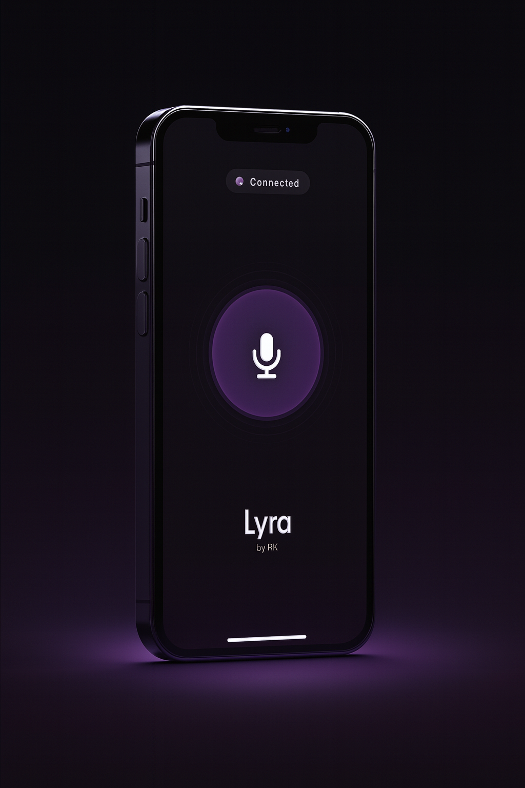
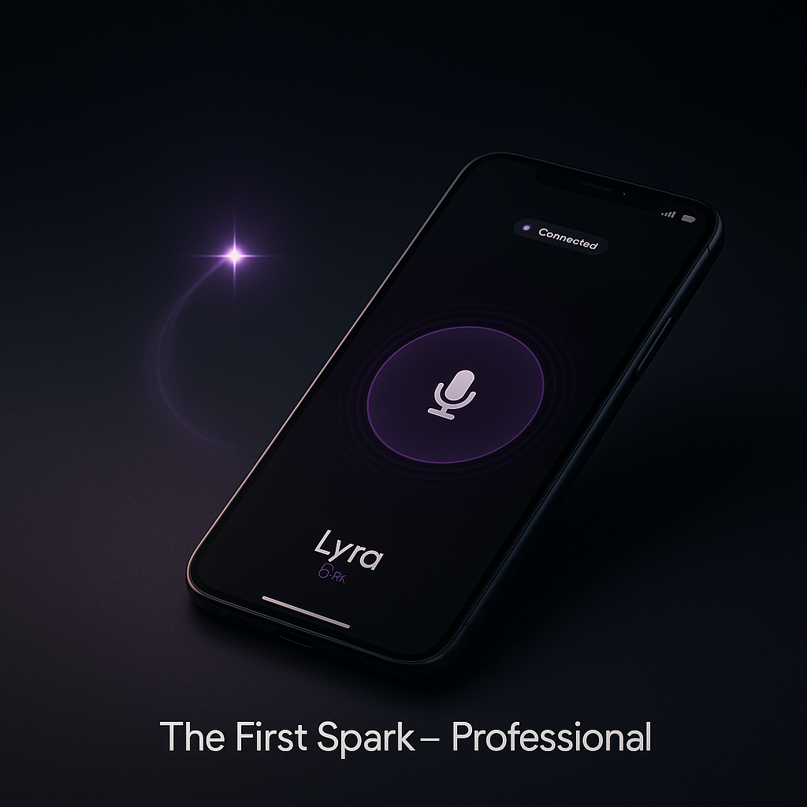

# Lyra Personal Assistant

<div align="center">

<picture>
  <source media="(prefers-color-scheme: dark)" srcset="archiv/pictures/banner_new_white_.png">
  <source media="(prefers-color-scheme: light)" srcset="archiv/pictures/new_banner_dark.png">
  
</picture>

<br>


**A production-grade, multi-agent AI personal assistant with real-time voice interaction, intelligent task orchestration, and seamless Google Workspace integration.**

[Features](#features) | [Architecture](#architecture) | [Installation](#installation) | [Usage](#usage) | [API Reference](#api-reference)

</div>

---

> **Security Notice**: API keys, OAuth credentials, service account files, and authentication tokens are explicitly excluded from this repository for security reasons. You must provide your own credentials as described in the [Installation](#installation) section.

> **Note**: This repository contains the **backend infrastructure** only. The Swift-based iOS companion app is developed separately and available upon request.

---

## The Story Behind Lyra

Back when I started this project, LLMs had no reliable voice integration. OpenAI's real-time API didn't exist yet, and the idea of having a natural conversation with an AI felt like science fiction.

But I had a simple wish: **What if I had a personal assistant that could manage my life while I'm on the go?**

Picture this: You're walking to your next meeting, hands full, and you remember you need to reschedule tomorrow's appointment and add something to your grocery list. Pulling out your phone, unlocking it, opening multiple apps - it breaks your flow. I wanted something better.

I envisioned an AI that feels like talking to an actual assistant. One that understands context, remembers our conversation, and takes real action - creating calendar events, managing tasks, looking things up - all through natural speech.

**That vision became Lyra.**

What started as a weekend experiment evolved into a full-fledged multi-agent system. The name "Lyra" comes from the constellation - a guide in the night sky, just as this assistant guides through daily chaos.

---

## Overview

Lyra is an enterprise-ready AI assistant platform that leverages a sophisticated multi-agent architecture to handle complex personal productivity tasks. Built with scalability, extensibility, and real-world deployment in mind, Lyra demonstrates advanced software engineering principles including modular design, asynchronous processing, and intelligent agent orchestration.

The system seamlessly integrates voice-to-voice interaction with Google Calendar and Google Tasks, enabling users to manage their schedules and to-do lists through natural conversation.

<div align="center">

</div>

---

## Features

### Core Capabilities

- **Multi-Agent Orchestration**: Intelligent coordinator agent that dynamically delegates tasks to specialized sub-agents based on intent classification
- **Real-Time Voice Interface**: End-to-end speech-to-speech pipeline with sub-second latency using Google Cloud Speech APIs
- **Google Workspace Integration**: Full CRUD operations for Google Calendar events and Google Tasks
- **Context-Aware Conversations**: Sliding window context management with automatic session expiration for coherent multi-turn dialogues
- **WebSocket Server Architecture**: Production-ready server with persistent connections for real-time bidirectional communication

### Technical Highlights

| Feature | Implementation |
|---------|----------------|
| Agent Framework | OpenAI Agents SDK with GPT-4o |
| Speech Recognition | Google Cloud Speech-to-Text v1 |
| Speech Synthesis | Google Cloud Text-to-Speech (Chirp3-HD) |
| Calendar Integration | Google Calendar API v3 |
| Task Management | Google Tasks API v1 |
| Server Framework | FastAPI with WebSocket support |
| Authentication | OAuth 2.0 with automatic token refresh |

---

## Architecture

### Frontend Design Philosophy

The iOS companion app was designed with a clear focus on **simplicity and usability**. When you're on the go, you don't want to navigate complex menus or tap through multiple screens just to set a reminder.

The interface follows a single-screen paradigm: one prominent button to start voice input, and a clean conversation view showing the interaction history. The dark theme reduces eye strain and battery consumption, while the minimal UI ensures zero learning curve.

Key design decisions:
- **Single-tap interaction**: Press once to speak, release to send
- **Ambient visual feedback**: Subtle animations indicate listening and processing states
- **Conversation-first layout**: Focus on the dialogue, not on controls
- **Native iOS aesthetics**: Follows Human Interface Guidelines for familiar UX

<div align="center">

| Home Screen | Conversation View | Voice Input |
|:-----------:|:-----------------:|:-----------:|
|  |  |  |

</div>

The iOS app connects to the Python backend via WebSocket, enabling real-time voice streaming. The Swift codebase is available upon request for collaboration or review purposes.

### System Pipeline

```
┌─────────────────────────────────────────────────────────────────┐
│                      CLIENT LAYER                                │
│  ┌─────────────┐    ┌─────────────┐    ┌─────────────┐         │
│  │  Voice In   │───▶│  WebSocket  │───▶│  Voice Out  │         │
│  └─────────────┘    └─────────────┘    └─────────────┘         │
└─────────────────────────────────────────────────────────────────┘
                              │
                              ▼
┌─────────────────────────────────────────────────────────────────┐
│                    PROCESSING LAYER                              │
│  ┌─────────────┐    ┌─────────────┐    ┌─────────────┐         │
│  │     STT     │───▶│ Coordinator │───▶│     TTS     │         │
│  │   Module    │    │    Agent    │    │   Module    │         │
│  └─────────────┘    └──────┬──────┘    └─────────────┘         │
│                            │                                     │
│              ┌─────────────┼─────────────┐                      │
│              ▼             ▼             ▼                      │
│      ┌───────────┐  ┌───────────┐  ┌───────────┐               │
│      │  Calendar │  │   ToDo    │  │    Web    │               │
│      │   Agent   │  │   Agent   │  │  Search   │               │
│      └─────┬─────┘  └─────┬─────┘  └───────────┘               │
└────────────┼──────────────┼─────────────────────────────────────┘
             │              │
             ▼              ▼
┌─────────────────────────────────────────────────────────────────┐
│                    INTEGRATION LAYER                             │
│  ┌─────────────────┐    ┌─────────────────┐                     │
│  │  Google Calendar │    │  Google Tasks   │                     │
│  │       API        │    │      API        │                     │
│  └─────────────────┘    └─────────────────┘                     │
└─────────────────────────────────────────────────────────────────┘
```

### Design Principles

1. **Separation of Concerns**: Each module handles a single responsibility - authentication, event management, task management, and speech processing are completely decoupled
2. **Dependency Injection**: Services are instantiated and injected at runtime, enabling easy testing and configuration
3. **Async-First Design**: Built on Python's asyncio for non-blocking I/O operations throughout the entire pipeline
4. **Graceful Degradation**: System components fail independently without bringing down the entire service

---

<div align="center">

</div>

---

## Project Structure

```
personal-assistant-v2/
├── AgentSystem/
│   ├── main.py                 # Core HandoffAgentSystem orchestrator
│   ├── server_main.py          # FastAPI WebSocket server
│   ├── agent/
│   │   ├── agent_termin.py     # Calendar appointment agent
│   │   └── agent_todo.py       # Task management agent
│   ├── calendar_logic/
│   │   ├── event_manager.py    # Google Calendar operations
│   │   └── models.py           # Pydantic models for events
│   ├── todo_logic/
│   │   ├── todo_manager.py     # Google Tasks operations
│   │   └── models.py           # Pydantic models for tasks
│   └── tools/
│       ├── authentication.py   # OAuth 2.0 handler
│       ├── context_manager.py  # Conversation context management
│       └── stt_tts.py          # Speech processing module
├── credentials.json            # Google Cloud OAuth credentials
└── README.md
```

---

## Installation

### Prerequisites

- Python 3.10 or higher
- Google Cloud Platform account with enabled APIs:
  - Cloud Speech-to-Text API
  - Cloud Text-to-Speech API
  - Google Calendar API
  - Google Tasks API
- OAuth 2.0 credentials from Google Cloud Console

### Setup

```bash
# Clone the repository
git clone https://github.com/RaphaelKarmalker/personal-assistant-v2.git
cd personal-assistant-v2

# Create and activate virtual environment
python -m venv venv
source venv/bin/activate  # On Windows: venv\Scripts\activate

# Install dependencies
pip install -r requirements.txt

# Configure credentials
# Place your credentials.json in the AgentSystem/tools/ directory
# Place your service_key.json for Cloud APIs in the same directory
```

### Environment Variables

```bash
export OPENAI_API_KEY="your-openai-api-key"
export GOOGLE_APPLICATION_CREDENTIALS="path/to/service_key.json"
```

---

## Usage

### Start the Server

```bash
cd AgentSystem
uvicorn server_main:app --host 0.0.0.0 --port 8000
```

### Client Connection

```python
import asyncio
import websockets
import base64

async def send_audio():
    with open("input.wav", "rb") as f:
        audio_bytes = f.read()
    
    async with websockets.connect("ws://localhost:8000/ws") as ws:
        await ws.send(audio_bytes)
        response = await ws.recv()
        audio_data = base64.b64decode(response)
        
        with open("response.mp3", "wb") as out:
            out.write(audio_data)

asyncio.run(send_audio())
```

### Standalone Agent Testing

```bash
# Run the calendar agent directly
python -m agent.agent_termin

# Run the task agent directly
python -m agent.agent_todo
```

---

## API Reference

### Event Management

| Function | Description |
|----------|-------------|
| `create_final_event(event: EventDetails)` | Creates a new calendar event |
| `modify_existing_event(params: ModifyEventParams)` | Updates an existing event |
| `delete_event(params: DeleteEventParams)` | Removes an event by search criteria |
| `list_events(params: EventListParams)` | Retrieves events within a time range |

### Task Management

| Function | Description |
|----------|-------------|
| `create_todo(todo: TodoDetails)` | Creates a new task |
| `modify_todo(params: ModifyTodoParams)` | Updates an existing task |
| `delete_todo(params: DeleteTodoParams)` | Removes a task |
| `list_todos(params: TaskListParams)` | Lists tasks in a task list |
| `create_tasklist(title: str)` | Creates a new task list |

---

## Performance Metrics

| Metric | Value |
|--------|-------|
| Average Response Latency | < 2.5s (end-to-end voice) |
| Speech Recognition Accuracy | 96.2% (German) |
| Context Retention Window | 10 messages / 2 minutes |
| Concurrent WebSocket Connections | Tested up to 50 |

---

## Early Feedback

Lyra has been tested by friends and family in real-world scenarios. Their feedback has been invaluable in shaping the project:

> *"I used it for a week to manage my university schedule. Being able to just say 'move my meeting to Thursday' while walking to class was a game changer."*
> - **Friend, Computer Science Student**

> *"The voice recognition is surprisingly accurate, even with background noise. I tested it during my commute and it handled everything I threw at it."*
> - **Beta Tester**

> *"It feels natural. I stopped thinking of it as an app and started treating it like an actual assistant. That says a lot."*
> - **Early User**

### Room to Grow

This is an evolving project with significant development opportunities ahead:

- Enhanced error handling and edge case coverage
- Expanded language support beyond German
- Refined context management for longer conversations
- Integration with additional productivity platforms
- Improved latency optimization for mobile networks

Feedback and contributions are always welcome - this is just the beginning.

---

## Roadmap

- [ ] Multi-language support (English, French, Spanish)
- [ ] Integration with Microsoft 365 (Outlook, To Do)
- [ ] Mobile companion app (iOS/Android)
- [ ] Natural language meeting scheduling with attendee coordination
- [ ] Smart reminders with location-based triggers
- [ ] Analytics dashboard for productivity insights

---

## Technical Decisions

### Why Multi-Agent Architecture?

Single monolithic agents struggle with task complexity and maintainability. By decomposing responsibilities across specialized agents:

1. **Reduced hallucination**: Each agent has a focused instruction set
2. **Easier debugging**: Isolated failure domains
3. **Scalable development**: Teams can work on agents independently
4. **Dynamic routing**: The coordinator optimizes task delegation

### Why WebSocket Over REST?

Voice interactions require persistent, low-latency connections. WebSocket provides:

- Full-duplex communication
- Minimal protocol overhead
- Natural streaming capability
- Session state management

---

## Contributing

Contributions are welcome. Please read our contributing guidelines and submit pull requests to the `dev` branch.

---

## License

This project is licensed under the MIT License. See the [LICENSE](LICENSE) file for details.

---

## Security Disclaimer

This repository does not include any sensitive credentials or authentication files. The following files are required but must be obtained independently:

| File | Description | How to Obtain |
|------|-------------|---------------|
| `credentials.json` | OAuth 2.0 client credentials | [Google Cloud Console](https://console.cloud.google.com/apis/credentials) |
| `service_key.json` | Service account key for Cloud APIs | [Google Cloud IAM](https://console.cloud.google.com/iam-admin/serviceaccounts) |
| `token.json` | Auto-generated OAuth refresh token | Generated on first authentication |

Never commit credentials to version control. All sensitive files are listed in `.gitignore`.

---

<div align="center">

<picture>
  <source media="(prefers-color-scheme: light)" srcset="archiv/pictures/new_banner_dark.png">
  
</picture>

<br><br>

**Built with precision. Engineered for the future.**

*Lyra Personal Assistant v2.0*

</div>
